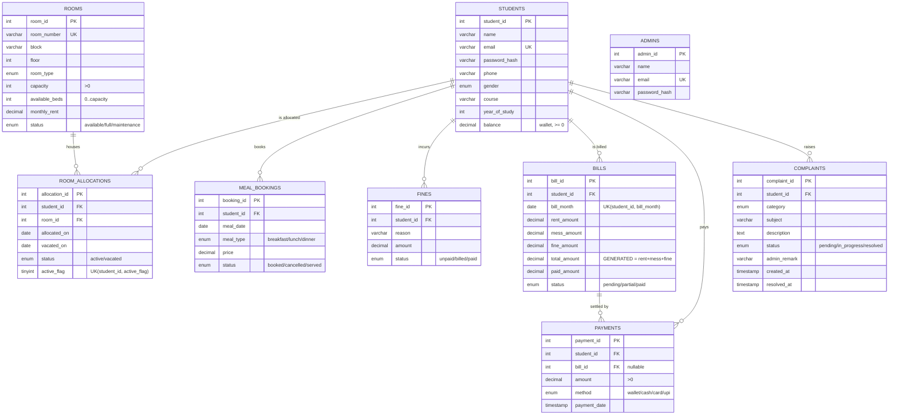

# Database Schema — Hostel & Mess Management System

Database: **`hostel_db`** · Engine: **InnoDB** (FK + transaction support) ·
Charset: **utf8mb4**. Full DDL in [`01_schema.sql`](01_schema.sql).

## Entity–Relationship diagram

## Relationships (foreign keys)

| Child table         | FK column    | → Parent (PK)        | On delete  |
|---------------------|--------------|----------------------|------------|
| `room_allocations`  | `student_id` | `students(student_id)` | CASCADE  |
| `room_allocations`  | `room_id`    | `rooms(room_id)`       | CASCADE  |
| `meal_bookings`     | `student_id` | `students(student_id)` | CASCADE  |
| `fines`             | `student_id` | `students(student_id)` | CASCADE  |
| `bills`             | `student_id` | `students(student_id)` | CASCADE  |
| `payments`          | `student_id` | `students(student_id)` | CASCADE  |
| `payments`          | `bill_id`    | `bills(bill_id)`       | SET NULL |
| `complaints`        | `student_id` | `students(student_id)` | CASCADE  |

`admins` is a standalone authentication table (no FK relationships).

## Cardinality summary

- **Student ↔ Room** is **many-to-many over time**, resolved through
  `room_allocations` (a history table). A partial-unique key
  `UNIQUE(student_id, active_flag)` enforces **at most one *active* bed** per
  student, while still allowing many past (vacated) rows.
- One **student** has many **meal bookings, fines, bills, payments, complaints**.
- One **bill** is settled by zero-or-more **payments** (supports part-payments).

## Tables at a glance

| Table | PK | Key columns | Notable constraints |
|-------|----|-------------|---------------------|
| `admins` | `admin_id` | email | `email` UNIQUE |
| `students` | `student_id` | email, balance | `email` UNIQUE; `balance >= 0`; `year_of_study` 1–6 |
| `rooms` | `room_id` | room_number, capacity, available_beds | `room_number` UNIQUE; `capacity > 0`; `0 <= available_beds <= capacity` |
| `room_allocations` | `allocation_id` | student_id, room_id, status | 2 FKs; `UNIQUE(student_id, active_flag)` = one active bed |
| `meal_bookings` | `booking_id` | student_id, meal_date, meal_type | `UNIQUE(student_id, meal_date, meal_type)` = no double-booking |
| `fines` | `fine_id` | student_id, amount, status | `amount >= 0` |
| `bills` | `bill_id` | student_id, bill_month | `UNIQUE(student_id, bill_month)`; `total_amount` GENERATED |
| `payments` | `payment_id` | student_id, bill_id, amount | `amount > 0`; `bill_id` FK SET NULL |
| `complaints` | `complaint_id` | student_id, status | status/timestamps driven by triggers |

## Indexes

Primary keys and UNIQUE keys are indexed automatically. Extra secondary indexes
for the reporting views:

- `idx_meal_date` on `meal_bookings(meal_date)`
- `idx_bill_status` on `bills(status)`
- `idx_complaint_st` on `complaints(status)`

## Programmable objects built on this schema

| Object | Type | File |
|--------|------|------|
| `student_dues_view`, `daily_meal_count_view`, `room_occupancy_view` | VIEW | [`02_views.sql`](02_views.sql) |
| `allocate_room`, `generate_monthly_bill` | PROCEDURE | [`03_procedures.sql`](03_procedures.sql) |
| `trg_alloc_after_insert/update`, `trg_complaint_before_insert/update` | TRIGGER | [`04_triggers.sql`](04_triggers.sql) |
| `pay_bill` | TRANSACTION (procedure) | [`05_transaction.sql`](05_transaction.sql) |
